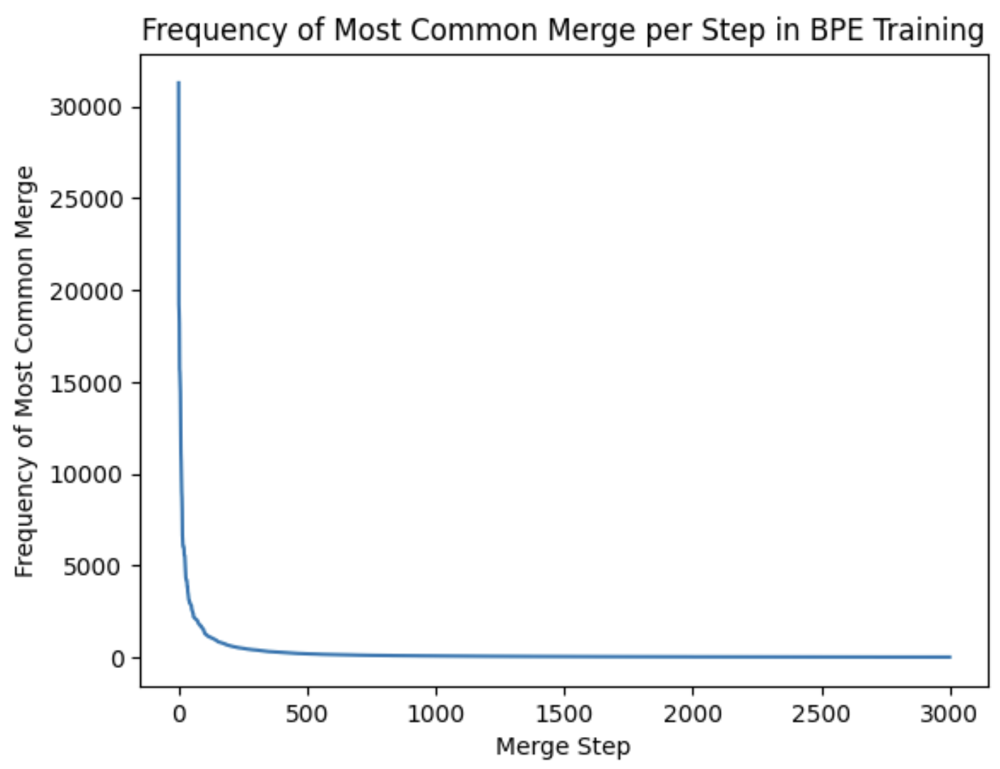
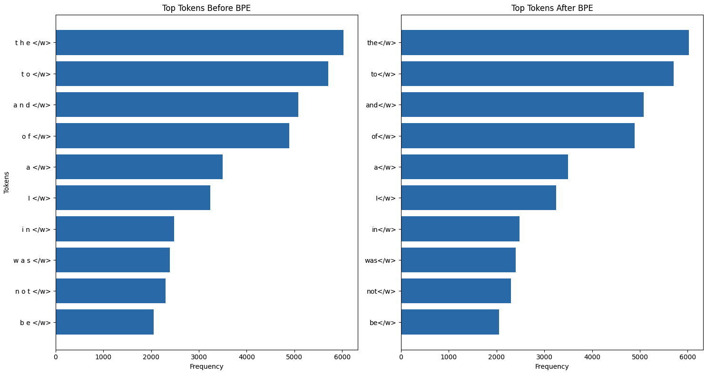

# Byte Pair Encoding (BPE)

### **Introduction**

Tokenization is a foundational step in many NLP tasks. It involves breaking down text into smaller units, known as tokens. These tokens can be words, characters, or subword units. The process is crucial for preparing raw text for further processing like parsing, syntax analysis, and semantic analysis.

The choice of tokenization method can significantly impact the performance of NLP models. It affects how the model perceives the structure of the text and interprets its meaning. For example, in languages where words are not separated by spaces, sophisticated tokenization techniques are essential for accurately identifying word boundaries.


### **Implementation**

- Development Steps:
    - The implementation of the Byte Pair Encoding (BPE) algorithm in Python involved several key steps to ensure the efficient learning of byte pair merges and the effective encoding/decoding of texts.
- Initial Vocabulary Creation:
    - The first step was to create an initial vocabulary from the training texts. This was achieved using the ```preprocess_and_create_vocab``` function, which took raw texts as input and processed them into a format suitable for BPE. Each word in the text was split into characters, separated by spaces, and appended with a special end-of-word token </w> to mark word boundaries. The function then built a frequency dictionary of these processed words, forming the initial vocabulary.
- Learning Byte Pair Merges:
    - The core of the BPE algorithm involves iteratively merging the most frequent pairs of characters or character sequences. This process was implemented through a loop that executed a specified number of merge operations (```num_merges```).
    - In each iteration, the ```get_stats``` function was called to calculate the frequency of adjacent character pairs in the current vocabulary. The most frequent pair was identified, and its frequency was recorded for analysis purposes.
    - The ```merge_vocab``` function then merged the identified pair throughout the vocabulary. This step involved replacing occurrences of the target pair with a single, merged token, thereby gradually reducing the granularity of the vocabulary from individual characters to larger subword units.

**Training on NLTK Dataset:**

- Selection of Books:
    - For training the BPE model, a selection of books from the NLTK Gutenberg Corpus was made. This included 'austen-emma.txt', 'blake-poems.txt', and 'shakespeare-hamlet.txt'. 
- Vocabulary Creation Process:
    - The raw texts of these books were first extracted using gutenberg.raw and then passed through the ```preprocess_and_create_vocab``` function to create the initial vocabulary. This vocabulary represented the starting point for the BPE learning process.
- Iterative Merging and Vocabulary Evolution:
    - Over the course of 3000 merge iterations, the BPE algorithm was observed to gradually shift from a character-level representation to a more complex subword-level representation. 
    - The frequencies of the merged pairs were tracked in ```merge_frequencies```, providing insights into the algorithm's learning dynamics and the relative importance of different byte pairs in the corpus.

**Conclusion:**

This implementation of the BPE algorithm on selected NLTK texts effectively demonstrates the algorithm's ability to learn and adapt to different linguistic contexts. The process highlights the transition from simple character-based representations to more nuanced subword units, underscoring the potential of BPE in handling a wide range of text tokenization challenges.

### **Experimental Setup**

**Test Dataset:**

- Selection of Books:
    - For the testing phase, a distinct set of books was selected from the NLTK Gutenberg Corpus, distinct from those used in the training phase. The chosen texts were 'austen-sense.txt', 'austen-persuasion.txt', and 'edgeworth-parents.txt'. This selection aimed to provide a diverse and challenging set of texts for evaluating the BPE algorithm.
- Differentiating from Training Dataset:
    - The key distinction between the test and training datasets lies in the content and style of the texts. While the training dataset included works like 'austen-emma.txt' and 'shakespeare-hamlet.txt', known for their distinct linguistic styles, the test dataset offered a different array of linguistic challenges. This separation ensured an unbiased evaluation of the BPE model's adaptability and effectiveness across varied literary works.

**Reference Tokenization:**

- Use of NLTK's Punkt Tokenizer:
    - To establish a ground truth for tokenization, NLTK's Punkt tokenizer was employed.
- Structured Format for Tokenized Results:
    - The results from the Punkt tokenizer were saved in a structured format, specifically as ```.txt``` files. 

**Standard Tokenization Comparison:**

- Baseline Tokenization with NLTK:
    - In addition to the reference tokenization, NLTK's ``wor`d_tokenize`` method served as a baseline for standard tokenization. This method is widely recognized for its robustness in handling various types of texts, making it an ideal standard for comparison.
- Comparative Analysis with BPE:
    - The performance of the BPE algorithm was meticulously compared with this standard tokenization on several metrics. These included precision, recall, F1-score, Jaccard similarity, and coverage.

**Evaluation Results:**

- Tokenization Coverage and Accuracy:
    - The BPE algorithm achieved a tokenization coverage of 3.33% and an accuracy of 3.71%. 
-  Performance on Individual Texts:
    - For 'austen-sense.txt', the BPE model showed a precision of 0.96, recall of 0.99, F1-score of 0.97, Jaccard similarity of 0.95, and coverage of 0.99.
    - For 'austen-persuasion.txt', the results were a precision of 0.95, recall of 1.00, F1-score of 0.97, Jaccard similarity of 0.95, and coverage of 1.00.
    - For 'edgeworth-parents.txt', the model achieved a precision of 0.95, recall of 0.99, F1-score of 0.97, Jaccard similarity of 0.94, and coverage of 0.99.

**Conclusion of Experimental Setup:**

- The experimental setup, encompassing the selection of a diverse test dataset and the employment of standard tokenization methods for comparison, provided a comprehensive framework for evaluating the BPE algorithm. 

### **Visualizations** 

**Frequency of Most Common Merge Per Step in BPE Training:**

- Analysis:
    - The first visualization, as shown in the accompanying figure, represents the frequency of the most common merge during each step of the BPE training process. This graph illustrates a steep decline, showcasing that the most frequent merges occur early in the training. The frequency of the most common merge decreases as the algorithm progresses, indicating that the algorithm starts by merging very common pairs and gradually moves to less frequent ones as the vocabulary becomes more refined.
- Interpretation:
    - This pattern is expected and demonstrates the efficiency of BPE in quickly identifying and merging the most common sequences in the dataset. Initially, simple and highly frequent character pairs are merged, which quickly reduces the complexity of the vocabulary. As training progresses, the merges become less frequent, but potentially more specific to the structure of the language in the corpus.

<p align ="center">

</p>

**Top Tokens Before and After BPE:**

- Analysis:
    - The second set of visualizations compares the top tokens in the vocabulary before and after the BPE merges. The two bar charts provide a clear comparison, with the left chart showing the top tokens before BPE training and the right chart after BPE training. Notably, the charts reveal a shift in the composition of the vocabulary, with tokens becoming more complex and presumably more meaningful as a result of the BPE process.
- Interpretation:
    - Before BPE, the vocabulary consists mostly of simple and common English words or parts of words. After BPE, the vocabulary reflects more complex tokens, many of which represent common substrings within words or entire words themselves. This change signifies BPE's ability to create a subword vocabulary that captures the morphological nuances of the language.



**Conclusion of Visualization**

These visualizations are instrumental in understanding the behavior of the BPE algorithm throughout its training. They offer tangible evidence of the algorithm's learning process, from the initial focus on high-frequency pairs to the emergence of a nuanced subword vocabulary. The graphical representations support the effectiveness of BPE in developing a compact and informative vocabulary that reflects the dataset's linguistic characteristics.

### **Conclusion**

**Key Findings:**

- The project successfully implemented and evaluated the Byte Pair Encoding (BPE) algorithm using the NLTK Gutenberg Corpus. Key findings include:
    - The BPE algorithm efficiently reduced the complexity of the initial character-level vocabulary by iteratively merging frequent byte pairs.
    - Training the BPE model on diverse literary texts revealed its adaptability in learning from a range of linguistic styles.
    - Evaluation against a separate test dataset demonstrated the BPE's ability to tokenize new texts with a high degree of precision, recall, and coverage.
    - Comparative analysis with standard tokenization methods highlighted BPE's potential in handling unknown words and providing more granular control over tokenization granularity.

**Learning Experience:**

- The exploration into BPE provided valuable insights into subword tokenization techniques and their importance in NLP. The hands-on experience emphasized the nuanced nature of language processing and the critical role of tokenization in preparing text data for NLP tasks.

**Potential of BPE in NLP Applications:**

- BPE's strength lies in its simplicity and effectiveness, particularly in scenarios involving limited training data or languages with rich morphology. The subword approach enables models to generalize better to unseen words, making BPE a compelling choice for tasks like machine translation and text generation.

**Challenges and Improvements:**

- One of the main challenges encountered was balancing the number of merge operations to avoid overfitting to the training data while still ensuring sufficient granularity for the test data.
- Future improvements could include dynamic adjustments to the merge operation thresholds based on the complexity of the texts being processed. Additionally, integrating a more context-aware approach to merges could potentially improve the algorithm's adaptability to different language domains.

### **References:**

- NLTK Project. (n.d.). NLTK 3.5 documentation. Retrieved from https://www.nltk.org/