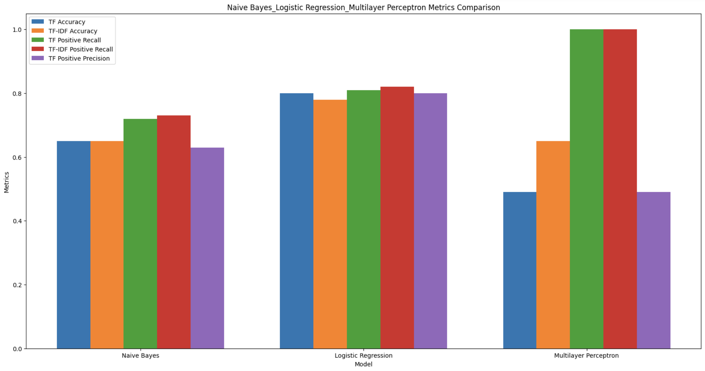

# Text Classification

### **Introduction**

This project aims to delve into the realm of text classification, a pivotal aspect of natural language processing, by implementing and comparing three distinct algorithms: Naive Bayes, Logistic Regression, and Multilayer Perceptron (MLP). Using the NLTK Movie Reviews dataset as a foundation, we endeavor to discern sentiments expressed in movie reviews.

A key focus is the exploration of two feature representations: Term Frequency (TF) and Term Frequency-Inverse Document Frequency (TF-IDF). TF offers a raw count of terms, providing a direct but sometimes over-simplified.

### **Data Preparation**

TThe dataset comprises movie reviews, each labeled as either positive or negative, making it an ideal resource for sentiment analysis.

- Dataset Overview: NLTK dataset contains two parts of information, one is the words used in each movie review, the other is the postive / negative sentiment defined of the movie review
- Preprocessing Steps:
    - Tokenization: used ```WordPunctTokenizer``` from ```nltk.stem``` for tokenization. This step is critical for converting raw text into a format that algorithms can process.
    - Stemming/Lemmatization: used ```WordNetLemmatizer``` from ```nltk``` for lemmatization. This process reduces words to their root form, aiding in the generalization of the model by consolidating different forms of a word.
    - Removing Stop Words: used ```stopwords``` from ```nltk.corpus``` to remove English format of stopwords.This step helps in focusing on the more meaningful words in the reviews.

### **Coverage Analysis**

The coverage analysis provides a visual depiction of the relationship between the number of tokens considered and the corresponding coverage percentage of the movie review dataset. Coverage percentage here refers to the proportion of the text data that is represented by the given number of tokens.


The plot exhibits a saturation curve typically characteristic of natural language data, where initially, the inclusion of additional tokens rapidly increases coverage. As more tokens are considered, each new token contributes less to the increase in coverage, indicating that the most common tokens are already accounted for in the early part of the curve.

- Rapid initial growth: The steep rise at the beginning of the curve indicates that a small fraction of unique markers constitute a significant portion of the data set. This is consistent with Zipf's law in linguistics, which states that a few words are used very frequently, while the frequency of less common words drops sharply.
- Diminishing returns: As we move along the x-axis, which represents the number of tokens, the curve starts to flatten. This suggests that adding more unique tokens does not significantly increase coverage. Most of these tags are probably rare words that don't appear often in reviews.
- Near Steady State: The curve approaches a steady state near the 100% coverage mark, indicating that there is a finite and relatively small set of unique marks that can represent nearly all the text data in the dataset. However, achieving absolute 100% coverage is often impractical as it would involve a long list of rare words, which increases complexity without significantly improving the representation of the dataset.


In summary, the coverage analysis plot is a foundational tool in natural language processing that informs the selection of features for text classification, optimizing the balance between the richness of the dataset representation and the computational efficiency of the models.

### **Algorithm Implementation**

In this project, three different machine learning algorithms were implemented for the sentiment analysis of movie reviews: Naive Bayes, Logistic Regression, and Multilayer Perceptron (MLP). 

- Feature Representation:
    - TF-IDF is a numerical statistic that reflects how important a word is to a document in a collection or corpus. It increases proportionally to the number of times a word appears in the document but is offset by the frequency of the word in the corpus, which helps to adjust for the fact that some words appear more frequently in general.
    - The shape of the train TF-IDF representation is (1602, 32232), indicating that there are 1,602 documents (movie reviews) in the training set and 32,232 unique tokens in the vocabulary. Similarly, the test TF-IDF representation shape is (398, 32232), with 398 documents in the test set. The matching number of features (32,232) in both train and test sets ensures consistency when applying the models.
- Naive Bayes:
    - Naive Bayes classifier is a probabilistic model based on Bayes' Theorem with an assumption of independence among predictors. Despite its simplicity and strong independence assumption, it has been found to work well for text classification, especially for baseline comparisons.

- Logistic Regression:
    - Logistic Regression is used when the dependent variable is categorical. In this case, it's used to predict whether a movie review has a positive or negative sentiment. It models the probability that each input belongs to a particular category.

- Multilayer Perceptron (MLP):
    - The MLP is a class of feedforward artificial neural network (ANN). An MLP consists of at least three layers of nodes: an input layer, a hidden layer, and an output layer. MLP utilizes a supervised learning technique called backpropagation for training.

- Model Training and Parameter Tuning:
    - Each model was trained on the TF-IDF representation of the training data. 
- Conclusion:
    - These algorithms were selected for their varied approaches to classification, providing a broad perspective on the text classification task. 
    - Naive Bayes offers a fast and often effective baseline, Logistic Regression gives a more powerful linear model with interpretable results, and MLP allows for complex pattern recognition through its neural network architecture.

### **Training, Evaluation, and Visualization**

In this phase of the project, each classifier—Naive Bayes, Logistic Regression, and Multilayer Perceptron (MLP)—was trained using both Term Frequency (TF) and Term Frequency-Inverse Document Frequency (TF-IDF) representations of the movie review data. The performance of these models was evaluated using several metrics: accuracy, precision, recall, F1 score, true positive rate (TPR), and false positive rate (FPR).
The visualizations of the metrics are shown below: 



- Naive Bayes:
    - The Naive Bayes classifier achieved an accuracy of 0.65 using both TF and TF-IDF. This indicates a modest ability to classify sentiment correctly.
    - The precision, recall, and F1 scores for the positive class were slightly better than those for the negative class when using TF, suggesting a somewhat better performance on positive sentiment detection.
    - However, the FPR was relatively high at 0.42 with TF and 0.43 with TF-IDF, implying that the model incorrectly labeled negative reviews as positive with some frequency.
-  Logistic Regression:
    -  Logistic Regression outperformed Naive Bayes with an accuracy of 0.8 using TF and 0.78 with TF-IDF, indicating a stronger predictive capability.
    - The balance between positive andnegative precision, recall, and F1 scores suggests the model has a fairly even performance on both positive and negative sentiment detection.
    - Notably, the TPR is high at 0.81 for TF, showing a good detection rate of positive sentiments, while maintaining a lower FPR of 0.2 compared to Naive Bayes, indicating fewer misclassifications of negative reviews.
- Multilayer Perceptron (MLP):
    - The MLP showed a significantly different performance pattern with an accuracy of 0.49 for both TF and TF-IDF. This is substantially lower than the other two models.
    - The precision for the positive class is equal to the accuracy, which along with a recall of 1.0 and an FPR of 1.0, indicates that the model predicted all reviews as positive. This is a clear sign of model failure, as it did not correctly identify any negative sentiment.
    - The negative class precision, recall, and F1 are all 0, reinforcing that the model did not identify negative reviews correctly.
- Comparative Analysis:
    - Comparing the two feature representations, TF and TF-IDF, we observe similar accuracies across the Naive Bayes classifier. However, for Logistic Regression, TF slightly outperforms TF-IDF in accuracy and FPR.
    - The performance of MLP indicates a serious issue with the model's predictions, as it failed to identify any negative reviews correctly, suggesting a need to revisit the model's configuration or training process.
- Discussion:
    - The Naive Bayes classifier shows reliable but not outstanding performance, which is typical for this type of baseline model.
    - Logistic Regression demonstrates robustness and a higher level of accuracy, making it a strong candidate for this sentiment analysis task.
    - The performance of the MLP is concerning and indicates that without proper tuning or with an inappropriate architecture, even complex models can fail to capture the underlying patterns in the data.
- Conclusion:
    - While Naive Bayes offers a decent baseline, Logistic Regression proves to be the most effective in this scenario. The MLP's performance highlights the challenges associated with neural networks, especially in scenarios where they may overfit to a particular class or fail to generalize due to improper training or architecture choices.

### **Discussion**

- Comparison of Algorithms:
    - The **Naive Bayes** classifier demonstrated moderate performance, which is expected given its probabilistic foundation and strong independence assumptions. It is computationally efficient, easy to implement, and provides a good baseline. However, its performance may be limited due to its simplistic assumption that features are independent, which is rarely the case in natural language.
    - **Logistic Regression** emerged as the top performer, offering both high accuracy and a balanced classification across positive and negative sentiments. It benefits from the ability to handle correlated features and provides interpretable results, which can be valuable for understanding sentiment drivers.
    - The **MLP** displayed suboptimal performance, which could be attributed to several factors including overfitting, an inadequate number of training epochs, or a poorly chosen network architecture. MLPs have the potential to model complex relationships due to their non-linear nature, but they require careful tuning and a sufficient amount of data to train effectively.
- Impact of Feature Representation:
    - The choice between TF and TF-IDF did not significantly affect the **Naive Bayes** classifier's performance, which suggests that within the scope of this dataset and task, the additional information provided by IDF does not drastically change the outcome for this algorithm.
    - For **Logistic Regression**, TF slightly outperformed TF-IDF, contrary to expectations, as TF-IDF is generally considered a more sophisticated and informative feature representation. This might indicate that the binary presence of terms (as emphasized by TF) is more indicative of sentiment than the relative importance of terms across documents (as emphasized by TF-IDF) for this particular dataset.
    - The **MLP**'s performance did not vary with the change in feature representation, which indicates issues with the model itself rather than the feature representation. 
- Strengths and Limitations:
    - **Naive Bayes** is advantageous for its simplicity, speed, and efficacy in dealing with large feature spaces. However, its assumption of feature independence can be a limitation in complex tasks like sentiment analysis where context and word relationships are important.
    - **Logistic Regression** is powerful for its ability to provide probabilities and handle inter-feature correlations, making it robust for text classification. However, it is a linear model and may not capture more complex relationships as effectively as non-linear models.
    - **MLP** offers flexibility and the ability to model non-linearities, which can be particularly useful for capturing the nuances of natural language. Nevertheless, its limitations include the need for large amounts of data, vulnerability to overfitting, and the requirement for extensive hyperparameter tuning.
- Conclusion:
    - This comparative analysis underscores the importance of matching the algorithm to the task and dataset at hand. While Naive Bayes and Logistic Regression are generally reliable for text classification, MLPs offer a higher ceiling of performance at the cost of increased complexity and a greater need for fine-tuning.
    - The choice between TF and TF-IDF should be informed by the specific characteristics of the dataset and the goals of the classification task. While TF-IDF often provides better performance in distinguishing relevant terms in a corpus, TF can be more straightforward and just as effective in some cases.